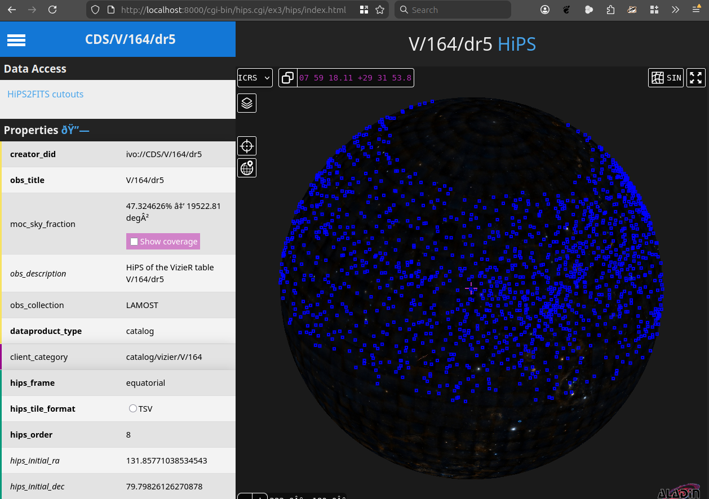

# `fitstable-cli` as the new version of `hipsgen-cat`

## About

Generate `HiPS` catalogues following the [HiPS](https://www.ivoa.net/documents/HiPS/) standard.

## History

The original [hipsgen-cat](https://aladin.cds.unistra.fr/hips/HipsCat.gml) tool was developed at CDS in Java more than
10 years ago.
It started as a proof of concept and later evolved into exploratory work oriented toward large all-sky catalogues stored
in the CDS RCF binary file format.
It was then slightly extended to support additional file formats -- VOTable, FITS, CSV -- thanks
to [STILTS](https://www.star.bris.ac.uk/~mbt/stilts/).
This extension, which uses an ASCII intermediary representation, was not designed for very large surveys.
The tool was also slightly modified with the introduction of the `--simple_algo`, option to better cope with catalogues
covering a small fraction of the sky.

In hindsight, the tool has not been completely satisfactory because:

* external users are not able to efficiently deal with large tables;
* the HEALPix order of the deepest tiles is limited to 11 or 12
    + hence, it is not suited for deep fields
* the number of possible input parameters is overly complex (it was exploratory);
* the algorithm is not naturally able to deal with data for which no score is defined
    + hence it is quite hard to build the HiPS of all VizieR tables
* the algorithm relies on a global density map with a smoothing function
    + but once we start zooming in, the density over different regions does not really matter anymore
* at CDS, a HiPS catalogue is made of a few indexed binary files, and tiles are built on the fly by a Tomcat servlet;
  whereas external users are forced to use the HiPS view, possibly containing millions of tiny TSV files
* ...

Since then, the VizieR code ecosystem has evolved a lot, especially with the introduction of the Rust programming
language.
We therefore decided to redevelop a new tool coping with most of the issues mentioned above, learning from our previous
experiments.

## Main differences between the old (Java) and this (Rust) version of `hipsgen-cat`

The new version of `hipsgen-cat` uses a slightly different approach:

* Although both the Java and Rust versions work from the HEALPix-sorted and indexed rows, the sorted rows are an
  internal temporary product in the Java version, while they form a self-consistent FITS file in the latter.
  (In the Java version, in case of failure when building the HiPS, the full data set had to be sorted again)
* For the `allsky` (order 1 and 2) products (containing `n1` and `n2` sources, respectively), we aim to show a
  source distribution matching the global density distribution of sources in the whole table. However:
    + the Java version uses a density map and a user-chosen function to determine the number of sources in order-3
      cells used to build both order-1 and order-2 allsky products;
    + the Rust version simply use regular sampling of the HEALPix-sorted rows with chunks of size `(n1+2)/nrows`:
        - the middle row of a chunk is taken if no score is defined;
        - otherwise, the row of the chunk with the highest score in chosen.
* From depth 3 onward, a constant number of row per tile is used. Nevertheless, the chunk strategy is applied
  building when building each tile in order to preserve the representation of the total density of sources in the cell.
* The Rust version of the tool temporarily keeps in memory the list of the rows selected in the various layers, so that
  two tiles in distinct layers of the same tile hierarchy may contain rows with the same score (which is not the case
  in the Java version).
* The Rust tool does not directly build the directory structure of a HiPS catalogue. Instead, it builds an intermediary
  representation made of a few (possibly large) files.

For an example of deep sources in a small fraction of the sky, see, e.g., the VizieR table `J/ApJ/950/125/table3`.

## Install

To build, query, and serve a HiPS catalogue from a FITS file, you should only need the `fitstable` command-line tool.
To build the tool from the source code on Linux of macOS:

```bash
# Install Rust

# Clone the "fitstable" repository
git clone https://github.com/cds-astro/cds-fitstable-rust.git
# Go to the downloaded directory
cd cds-fitstable-rust
# Compile and install the tool in your environment
# * use the "cgi" feature if you want to serve the hips-catalogue
cargo install --features cgi --path cracle/cli
# Possibly check the CLI destination
which fitstable
```

## Prerequisite: HEALPix sorted and indexed FITS(+) file

The table to be transformed must be a single, HEALPix sorted and indexed, BINTABLE FITQ file.
To benefit from rich metadata, we specifically advice the usage of
the [FITS-plus](https://www.star.bris.ac.uk/mbt/stilts/sun256/fitsPlus.html) format,
see [TOPCAT](https://www.star.bris.ac.uk/mbt/topcat/sun253/outFits.html)/[STILTS](https://www.star.bris.ac.uk/~mbt/stilts/)
possible outputs.

To get such a file from a single `mytable.fits`, regular FITS file:

```bash
# Look at the indices of the coordinate columns you want to use in the HiPS
fitstable info mytable.fits
# Sort the table using the indices of the positional columns
# (for large table, you may adjust the depth (order) and the size of the memory chunk)
fitstable sort mytable.fits mysortedtable.fits --lon LON_COL_INDEX --lat LAT_COL_INDEX
```

To get such a file from a set for FITS file, having the same structure, in a `mydir` directory:

```bash
# Look at the indices of the coordinate columns you want to use in the HiPS
fitstable info mydir/anyfile.fits
# Concatenate and sort all the files using the indices of the positional columns
# (for a large output table, you may adjust the depth (order) and the size of the memory chunk)
fitstable sort mydir mysortedtable.fits --lon LON_COL_INDEX --lat LAT_COL_INDEX
```

Create a Cumulative HEALPix index on the HEALPix ordered rows:

```bash
fitstable mkidx mysortedtable.fits mysortedtable.hidx.fits --lon LON_COL_INDEX --lat LAT_COL_INDEX
```

Not relevant here, but now you can now perform efficient positional queries on the (possibly very large) FITS file,
see `fitstable qidx --help`, e.g.:

```bash
# Get all sources in a HEALPix cell 4/1
fitstable qidx mysortedtable.hidx.fits result.fits hpx 4 1
```

Such HEALPix sorted and indexed files are used to generate on-the-fly HATS products on all VizieR tables.

## Build a HiPS Catalogue

### Simplest possible command

The simplest possible command, with no score, is:

```bash
fitstable mkhips mysortedtable.hidx.fits myhipsdir
```

WARNING: the input file is the HEALPix cumulative index file. It contains, in its FITS keywors, the name of the
indexed file together with the indices of the positional columns use for the HEALPix sorting (and indexaxtion).

### Advanced (score, properties, options explained! RUSTLOG, ...)

#### Log messages

For debugging, or to see the progress, the user may adapt the logging level with the `RUST_LOG` variable,
more details [here](https://docs.rs/env_logger/latest/env_logger/#enabling-logging), e.g.:

 ```bash
 RUST_LOG=trace fitstable mkhips mysortedtable.hidx.fits myhipsdir
 ```

#### Using a score

You may use a score to control which sources appear first in the HiPS hierarchy.
You may use either an existing column or an expression. The most common case is to show the brightest sources first,
i.e. sources with the smallest magnitudes. We therefore chose to display first the sources having **the smallest score
**.
We rely on the [expreval](https://github.com/cds-astro/cds-expreval-rust) crate for expression evaluation.
Among the available functions, `cavg` computes the mean value of several columns and is compatible with partially filled
columns. Here an example:

 ```bash
 RUST_LOG=debug fitstable mkhips --score 'cavg(Jmag1,Hmag,Kmag)' mysortedtable.hidx.fits myhipsdir
 ```

#### Adding `properties` on the command line

Instead of editing manually some properties of the generated `properties.toml` file, you can set up them from
the command line. Here is a complete example used for a CDS table:

```bash
RUST_LOG=debug fitstable mkhips --score 'cavg(mag1,mag2,mag3,mag4,mag5,mag6,mag7)' \
  --creator-did "ivo://CDS/V/164/dr5" \
  --publisher-id "ivo://CDS" \
  --obs-collection "LAMOST" \
  --obs-title "V/164/dr5" \
  --obs-description "HiPS of the VizieR table V/164/dr5" \
  --hips-creation-date "2026-02-12T00:00Z" \
  --hips-service-url "https://xxxx.cds.unistra.fr/hips/V/164/dr5" \
  --hips-status "public master unclonable" \
  --client-category "Catalog/VizieR/V/164" \
  V_164_dr5.hcidx.fits V_164_dr5_hips 
```

#### Usage

Here the detailed `usage` of `fitstable mkhips`:

```bash
> fitstable mkhips --help
Create a HiPS catalogue from a HEALPix sorted and index BINTABLE

Usage: fitstable mkhips [OPTIONS] <FILE> <DIR>

Arguments:
  <FILE>  Path of the FITS file index (not the file containing the data)
  <DIR>   Output directory containing the HiPS

Options:
  -n, --n1 <N>
          Number of sources at level 1 (if allsky) [default: 3000]
  -r, --r21 <R21>
          Ratio between the number of source in level 2 and level [default: 3]
  -m, --n-t <N_T>
          From level 3, number of cell per tile [default: 500]
  -m, --score <SCORE>
          Score, if any: sources with the highest score appear first in the hierarchy
      --creator-did <CREATOR_DID>
          Unique identifier of the HiPS, e.g. `ivo://CDS/I/355/gaiadr3` [default: ivo://${PUBLISHER}/${HIPS_NAME}]
      --publisher-id <PUBLISHER_ID>
          Unique ID of the HiPS publisher, e.g. `ivo://CDS`
      --obs-collection <OBS_COLLECTION>
          Short name of original data set, e.g `Gaia`
      --obs-title <OBS_TITLE>
          Data set title, e.g. `Gaia DR3 Main source` [default: ${TITLE}]
      --obs-description <OBS_DESCRIPTION>
          Data set description
      --obs-ack <OBS_ACK>
          Acknowledgment mention
      --prov-progenitor <PROV_PROGENITOR>
          Provenance of the original data
      --bib-reference <BIB_REFERENCE>
          Bibliographic reference
      --bib-reference-url <BIB_REFERENCE_URL>
          URL to bibliographic reference
      --obs-copyright <OBS_COPYRIGHT>
          Copyright mention
      --obs-copyright-url <OBS_COPYRIGHT_URL>
          URL to a copyright mention
      --obs-regime <OBS_REGIME>
          General wavelength, e.g. "Radio", "Optical", "UV", "X-ray"
      --data-ucd <DATA_UCD>
          Data UCDs
      --hips-publisher <HIPS_PUBLISHER>
          Institute or person who built the HiPS, e.g. `CDS (N. Surname)`
      --hips-creation-date <HIPS_CREATION_DATE>
          HiPS first creation date, format: `YYYY-mm-ddTHH:MMZ`
      --hips-service-url <HIPS_SERVICE_URL>
          HiPS public URLs, e.g. `https://hipscat.cds.unistra.fr/HiPSCatService/I/255/gaiadr3`
      --hips-status <HIPS_STATUS>
          Status when shared in a HiPS node [default: "public master clonableOnce"]
      --hips-frame <HIPS_FRAME>
          Positions frame, default value should not be changed! [default: equatorial]
      --t-min <T_MIN>
          Start time of the observations, in MJD
      --t-max <T_MAX>
          Stop time of the observations, in MJD
      --em-min <EM_MIN>
          Start in spectral coordinates, in meters
      --em-max <EM_MAX>
          Stop in spectral coordinates, in meters
      --client-category <CLIENT_CATEGORY>
          '/' separated keywords suggesting a display hierarchy to the client, e.g. catalog/vizier/I
  -h, --help
          Print help
```

## Details on HiPS catalogue output files

Here the typical content of the HiPS output file:

```bash
/myhipsdir
 ├── hips.cat.layer1.fits
 ├── hips.cat.layer1.hcidx.fits
 ├── hips.cat.layer2.fits
 ├── hips.cat.layer2.hcidx.fits
 ├── ...
 ├── hips.cat.layerN.fits
 ├── hips.cat.layerN.hcidx.fits
 ├── moc.fits
 ├── properties.toml
 └── tiles.bstree
```

in which:

* `hips.cat.layerX.fits`: the HEALPix sorted FITS file containing all rows of the HiPS tiles (or allsky) at depth `X`;
* `hips.cat.layer2.hcidx.fits`: Cumulative HEALPix index for file `hips.cat.layerX.fits`, to quicky retrieve all rows in
  a given tile
* `moc.fits`: the footprint of the leaf tiles in the HiPS hierarchy
* `properties.toml`: a TOML file containing the value to be put in the HiPS `properties` file (can be edited by hand, at
  our own risks)
* `tiles.bstree`: the file made quicky list all tiles (at all resolution) and quicky look for a given tile statistics (
  i.e.
  the total number of row in the tile, including sources in lowest resolution tiles, and the total number of row in the
  HEALPix cell
  corresponding to the tile); relies
  on [bstree-file-readonly](https://github.com/cds-astro/cds-bstree-file-readonly-rust)

## Query a HiPS Catalogue

To perform local queries on the generated HiPS catalogue, and retrieve all possible files of the HiPS standard,
one can use the `fitstable qhips` command:

```bash
> fitstable qhips --help
Query a HiPS catalogue

Usage: fitstable qhips <DIR> <COMMAND>

Commands:
  properties  Get the `properties` file
  metadata    Get the `metadata.xml` file
  moc         Get the `Moc.fits` file (WARNING: binary data in stdout!)
  allsky      Get the `Norder${depth}/allsky.tsv` file
  tile        Get the `Norder${depth}/Dir[0-9]*/Npix${hash}.tsv` file
  list        Get the list of all tiles, together with their statistics
  info        Print the landing Page (i.e. the `index.html` page)
  help        Print this message or the help of the given subcommand(s)

Arguments:
  <DIR>  Path of the HiPS directory

Options:
  -h, --help     Print help
  -V, --version  Print version
```

You can also get the help message of sub-command using `--help` anywhere in the command hierarchy:

```bash
> fitstable qhips tile --help
Get the `Norder${depth}/Dir[0-9]*/Npix${hash}.tsv` file

Usage: fitstable qhips <DIR> tile <DEPTH> <HASH>

Arguments:
  <DEPTH>  
  <HASH>   

Options:
  -h, --help  Print help

```

Examples:

```bash
# Get the HiPS properties
fitstable qhips myhipsdir/ properties
# Get the Allsky.tsv file at order 1:
fitstable qhips myhipsdir/ allsky 1
# Get the tile 4/15
fitstable qhips myhipsdir/ tile 4 15
```

Remark: using the output of the `fitstable qhips list` command it is quite easy to build
a script building the hierarchy of files of a HiPS catalogue product as described in the standard.

## Web view on a local server

To locally visualise your local HiPS product in a Web Browser, you have to run a local server
and use `fitstable` as a CGI.
From you any directory containing you HiPS(s) directories:

```bash
# Create a `cgi-bin` directory
mkdir cgi-bin
# Put inside the `fitstable` CLI that you rename as `hips.cgi`
cp $(which fitstable) cgi-bin/hips.cgi
# Run a local python server with the --cgi option
python -m http.server --cgi 8000
# Open you favorite web browser with the URL:
firefox http://localhost:8000/cgi-bin/hips.cgi/path/to/hips/index.html &
```

Your local repository (the one from which you started the pyhton server) should looks like:

```bash
// /CurrentDir
// ├── path/to/hips
// ├── cgi-bin/
// │ └── hips.cgi
```

If everything works correclty you should visualize you HiPS in AladinLite V3 and see something like:



## Publish you HiPS catalogs

TBW!

## Benchmark

TBW

## Alternative tools

* The legacy hipsgen-cat tool in Java is still available [here](https://aladin.cds.unistra.fr/hips/HipsCat.gml)
* A recent alternative, in Python, possibly running in parallel on a cluster of machines, also able to generate HiPS
  from HATS
  products is available [here](https://github.com/linea-it/hipscatalog_gen)